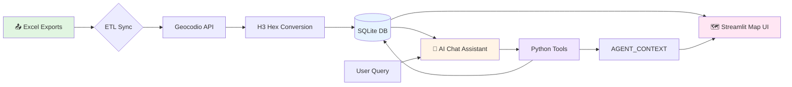

# 🏥 Agentic Staffing Dashboard

🎯 Interactive Spatial Map • 🤖 Generative AI Assistant • 🔒 Privacy-Preserving Architecture • 📊 Deterministic Tool Calling

> **Companion repository for Chapter 7 — Proactive and Event-Driven Agents**
> *The Write Path: Building Production-Grade Agentic Systems* by Mohit Aggarwal

**A secure, conversational dashboard for Directors of Nursing (DON).** Find available caregivers near clients using natural language, powered by Google ADK and Gemini, without ever exposing raw GPS coordinates or PHI to external APIs.


## 🚀 Quick Start

### Prerequisites

```bash
✅ Python 3.9+
✅ uv (astral.sh)
✅ Geocodio API Key (for address geocoding)
✅ Google AI Studio API Key (for the LLM assistant)
```

### Installation in 3 Steps

**1️⃣ Install uv (ultra-fast Python package manager)**
```bash
curl -LsSf https://astral.sh/uv/install.sh | sh
```

**2️⃣ Clone and setup**
```bash
git clone https://github.com/mohitagr18/ch7-proactive-event-driven-agents.git
cd ch7-proactive-event-driven-agents
cp .env.example .env  # Or create .env manually
```
*Edit `.env` with your API keys before proceeding.*

**3️⃣ Start the dashboard**
```bash
uv sync
uv run streamlit run src/app.py
```
🎉 **Done!** Open **http://localhost:8501** in your browser.


## 🏗️ Architecture

<div align="center">



</div>


## 🎯 Key Privacy Features

| Feature | Implementation | Benefit |
|---------|----------|------|
| **No Coordinates** | GPS converted to H3 Hexagons instantly | Exact street addresses cannot be reverse-engineered |
| **PII Purging** | Addresses/DOB purged post-ETL | Local database contains minimized risk profile |
| **Double-Blind Sync** | SHA-256 Hashes of Name+Address | Detects address changes without storing string |
| **Bypass LLM Hallucinations** | Tools write UI updates to side-channel | LLM never receives/renders names or contact info |

#### 🗺️ What is an H3 Hexagon?
This application uses **[Uber's H3 Spatial Index](https://h3geo.org/)** at **Resolution 8** to instantly anonymize client and caregiver locations.
- **Area Covered**: Each Resolution 8 hexagon covers approximately **0.73 sq km (0.28 sq miles)**.
- **Privacy Impact**: By storing *only* the H3 index instead of precise latitude/longitude coordinates, it becomes mathematically impossible to reverse-engineer a specific street address.


## 🎮 Usage & Features

### 1️⃣ Data Sync
Drop **CustomerData.xlsx** and **CaregiverData.xlsx** into the `data/` folder and click **🔄 Refresh Data** in the sidebar.

### 2️⃣ Map Interaction
- Click any **blue client hexagon** to focus the map.
- Adjust the **Distance Radius** buttons to filter nearby staff.
- View staff capacity represented by hexagon opacity (darker green = more available hours).

### 3️⃣ AI Staffing Assistant
Chat naturally with the agent:
- "Find a PCA near Client C005"
- "How many RNs do we have?"
- "Find LPNs within 15 miles of Client C001"
- Follow-up: "What about PCAs instead?" (Maintains conversational memory)


## 📊 Workflows

Detailed Mermaid diagrams available in [`workflows/`](./workflows/):
- 🏗️ **[ETL Pipeline Workflow](./workflows/etl_pipeline.md)** — Secure address to H3 index ingestion
- 🔄 **[Agent Orchestration](./workflows/agent_orchestration.md)** — ADK tool routing and context side channels
- 🔍 **[Privacy Mapping](./workflows/privacy_mapping.md)** — Folium hex map generation without raw coordinates


## ⚙️ Configuration

```bash
# 🤖 AI Assistant Configuration
GOOGLE_API_KEY=your_google_ai_studio_key_here

# 🗺️ Geocoding Settings
geocodio_api_key=your_geocodio_key_here

# 📊 Opik Tracing (Optional)
OPIK_API_KEY=your_opik_key_here
OPIK_PROJECT_NAME=agentic_healthcare_staffing
```


## 📁 Project Structure

```text
ch7-proactive-event-driven-agents/
├── 📱 src/
│   ├── app.py            # 🚀 Streamlit frontend app
│   ├── agent.py          # 🤖 Google ADK Agent + Tool logic
│   └── logger.py         # 📝 Loguru centralized configuration
├── 🛠️ etl/
│   └── sync.py           # 🔄 ETL pipeline (Excel → Geocodio → H3 → SQLite)
├── 📚 workflows/         # 📖 Architecture docs + Mermaid diagrams
├── 📂 data/              # 📥 Target for CustomerData & CaregiverData Excel drops
├── 📂 logs/              # 📝 Rotating daily log storage
├── .env.example          # 🔐 Config template
└── pyproject.toml        # 📦 Dependencies mapping using uv
```


## 🎓 Technology Stack

- **Framework**: [Streamlit](https://streamlit.io) — Interactive Python UI
- **AI Agent**: [Google ADK](https://github.com/google/google-adk) + Gemini `flash-lite-preview`
- **Spatial Index**: [Uber H3](https://h3geo.org/) — Hexagonal hierarchical spatial index
- **Database**: [SQLite](https://www.sqlite.org/) — Local secure storage
- **Logging**: [Loguru](https://github.com/Delgan/loguru) — Clean asynchronous logging
- **Metrics**: [Opik](https://www.comet.com/site/products/opik/) — Agent tracing and evaluation
- **Package Manager**: [uv](https://astral.sh/uv) — Ultra-fast Python packaging


## ⚠️ Data Privacy

This app is governed by strict PII separation. GPS coordinates are **never persisted** — only H3 hex indexes. The only data sent externally is: (1) plain address strings to Geocodio for batch geocoding, and (2) sanitized tool queries to Google's Gemini API.
