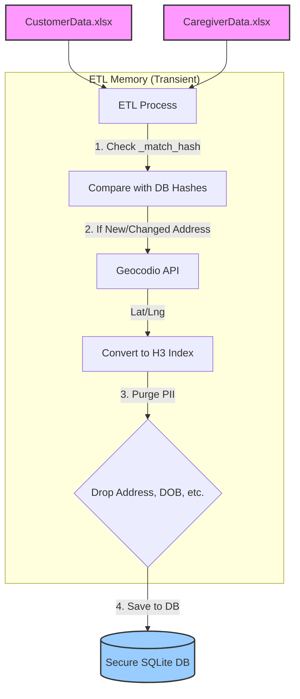
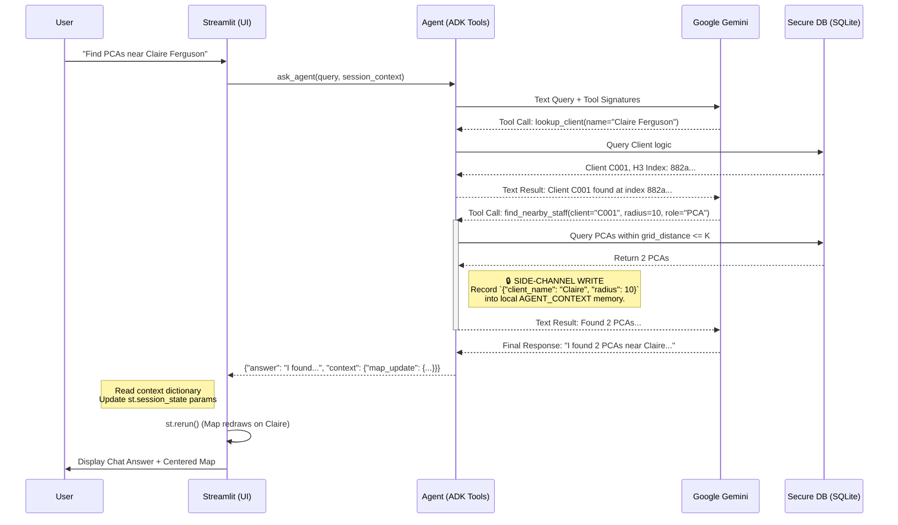

# YTI Homecare — Privacy & Architecture Design

This document details the architecture of the Agentic Staffing Dashboard, focusing on how we maintain strong data privacy (PII/PHI protection) while enabling advanced AI and spatial features.

## 1. Core Principles

1. **No Raw Coordinates in Database:** Exact GPS coordinates are considered highly sensitive. They exist only transiently in memory and are discarded. The database only stores Uber H3 hexagonal indices (Resolution 8).
2. **Minimal PII Retention:** Addresses, ZIP codes, and Birth Dates are strictly purged from the system after geographical and hashing steps are complete.
3. **Opaque Hashing for Sync:** To sync Excel updates without storing addresses, we use deterministic SHA-256 hashes of the `Name + Address` string.
4. **LLM Sandboxing:** The AI (Google Gemini) never executes raw SQL and never sees the whole database. It only receives targeted, minimized contextual data returned by strictly defined Python tools.
5. **Deterministic Map Control:** The map UI doesn't rely on the LLM to format JSON to control the map focus. Instead, it uses an invisible "Side-Channel" written by the deterministic Python tools.

---

## 2. The Ingestion Pipeline (ETL)

The ETL process runs locally on the DON's machine. It takes the agency Excel exports and converts them into a privacy-safe SQLite database.

### The SHA-256 Surrogate Key

To know if a caregiver moved (and needs re-geocoding), the system must compare the new Excel file to the database. However, rule #2 dictates we cannot store addresses in the database.

**The Solution:** During ETL, we compute `hashlib.sha256("first_name|last_name|fulladdress")` and store it as `_match_hash`.
- **Privacy:** It is impossible to reverse-engineer an address from the hash.
- **Robustness:** A hash mismatch on an existing name immediately flags an address change, triggering a targeted re-geocode without the DB ever holding the raw address string.

---

## 3. The AI & Map Architecture

When the DON asks the Assistant a question, the request flows through the Google ADK, into Gemini, back to local Python tools, and finally synchronizes with the Streamlit Map UI using a **Side-Channel**.

### Why the Side-Channel matters
If we relied on the LLM to output a JSON object to control the UI, it could hallucinate names, invent radii, or format the JSON incorrectly, crashing the app.

By having the deterministic Python tool (`find_nearby_staff`) write the actual `client_name` and `radius` to a local dictionary *while it executes*, we guarantee that the map perfectly reflects the exact data the underlying database tool queried. The LLM never even knows the UI map is updating.
