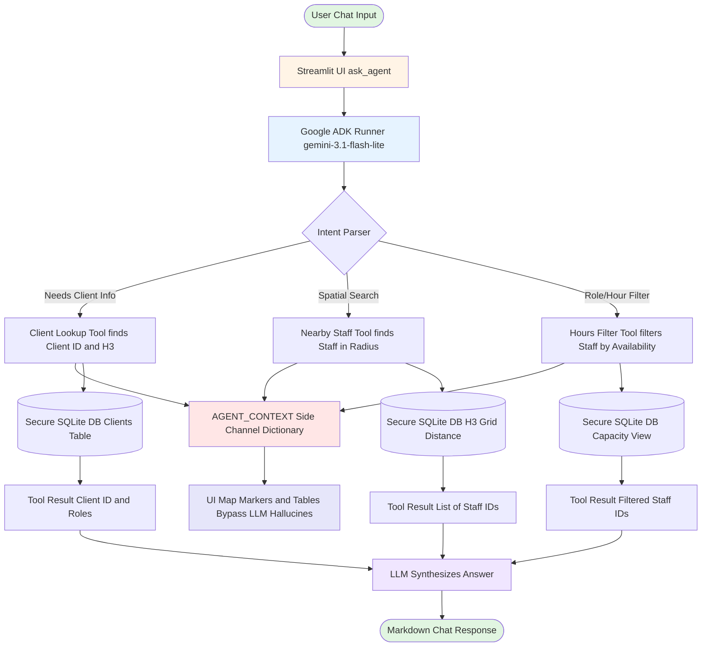

# Agent Orchestration Workflow

The AI Staffing Assistant acts as a conversational bridge between the Director of Nursing (DON) and the secured H3 database. It utilizes **Google ADK** to perform deterministic Tool Calling.

## Workflow Diagram

## Key Components

### 1. In-Memory Runner
- Preserves context across chat messages via `InMemoryRunner`, simulating LangChain's memory buffer.
- Tracks active `session_id` directly to a local Python dictionary inside ADK.

### 2. Pydantic Constraints
Each Python tool is decorated with strict Pydantic `BaseModel` schemas:
- `ClientLookupInput`
- `NearbyStaffInput`
- `StaffFilterInput`

### 3. H3 Traversal Rules
- `find_nearby_staff` computes search arrays recursively. It translates `miles` directly into H3 k-ring bounds (e.g., 5 miles ≈ 10 H3 k-rings at integer Resolution 8).
- Runs `h3.grid_distance()` natively in Python rather than depending on heavy PostGIS databases.

### 4. Deterministic UI State
- Rather than forcing the LLM to write out structured JSON mapping states, the `AGENT_CONTEXT` global dictionary exposes a side channel.
- As tools execute (e.g. `find_nearby_staff`), they write their raw output to `AGENT_CONTEXT["map_update"]` — Streamlit reads this to render the map instantly.
- **Privacy Redaction**: The Tools only return Staff IDs to the LLM (so the LLM cannot hallucinate or steal names/contact info). The Map looks up the names locally.
