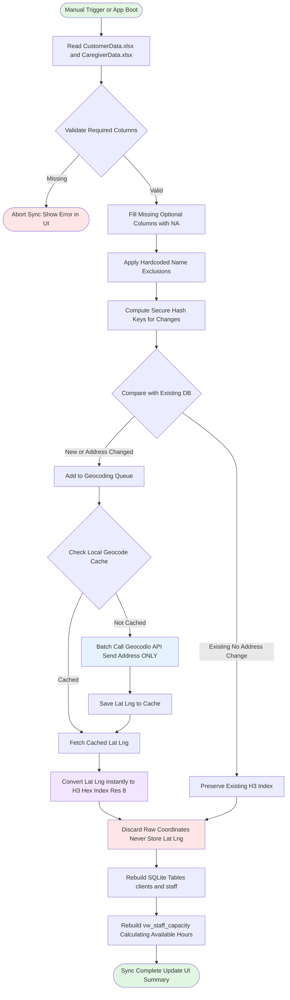

# ETL Pipeline Workflow

The Data Synchronization Pipeline (ETL) is responsible for taking raw Excel exports from the agency system, processing them securely, and writing privacy-safe location data (H3 grid cells) to the local SQLite database.

## Workflow Diagram

## Key Components

### 1. Data Ingestion
- Reads `CustomerData.xlsx` and `CaregiverData.xlsx` via pandas.
- Enforces strict required columns (`First Name`, `Last Name`, `Address 1`, `City`, `State`, `Zip`).
- Silently ignores unneeded PII columns.

### 2. Opaque Tracking (Surrogate Keys)
Rows are tracked without storing their raw addresses for matching.
- A stable surrogate key is generated combining `SHA-256(fname | lname | address_string)`.
- Compare against existing keys to detect new addresses.

### 3. Incremental Geocoding
- Uses the **Geocodio API** to convert string addresses into raw coordinates.
- Only the specific address string is sent over the network (No Names, No Phone Numbers).
- Caches results locally in SQLite to prevent redundant API calls.

### 4. Privacy via H3 Grid
- The raw `Latitude` and `Longitude` returned by Geocodio are converted immediately in memory into **H3 Hexagonal Indexes**.
- The raw coordinates are then discarded before writing to the secure application database.

### 5. Capacity Calculation
- The `vw_staff_capacity` view calculation is baked directly into the staff table so that the AI can quickly filter staff by integer logic on available versus committed hours.
