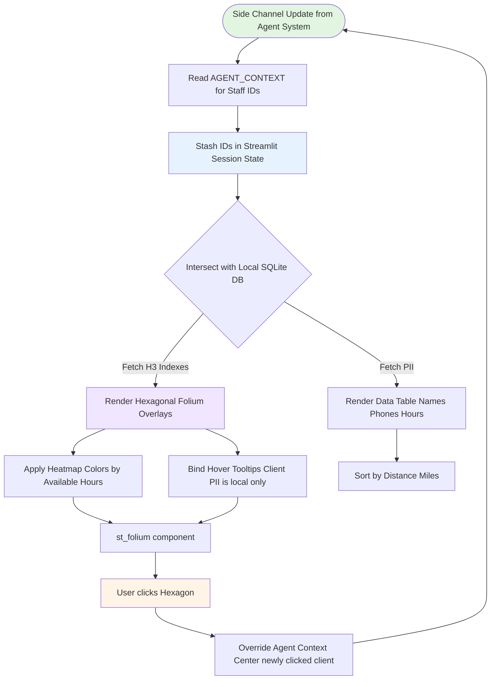

# Privacy Map Rendering Workflow

The application places a deep structural emphasis on shielding Personal Health Information (PHI) and Personally Identifiable Information (PII). Location coordinates are completely wiped from the DB infrastructure.

## Workflow Diagram

## Key Components

### 1. The Discard Protocol
The raw Latitude and Longitude variables are never inserted into SQLite. `etl/sync.py` purges them the moment H3 resolution conversion completes.

### 2. Hexagonal Clustering (Folium)
Instead of plotting traditional exact pins using Folium `Marker`, the Map Engine looks up the pre-computed H3 Index, pulls its explicit `h3.cell_to_boundary()`, and draws an obfuscated polygon area.
- Gives the Director of Nursing spatial awareness up to ~0.74 square kilometers (enough to coordinate rideshares and commutes).
- **Security Check**: This spatial resolution prevents precise street or housing deduplication, natively protecting both Staff home addresses and Client private facilities.

### 3. Color Depth Signals
- Staff members glow heavier and brighter depending on their `Available_Hours`.
- PCA, LPN, and RNs each use a distinct Hexagon border color mapping.

### 4. Interactive Feedback
Clicking any hexagon overrides the LLM's current targeted focus, routing the focus context strictly back through Streamlit `st.rerun()` directly bypassing the API completely.
